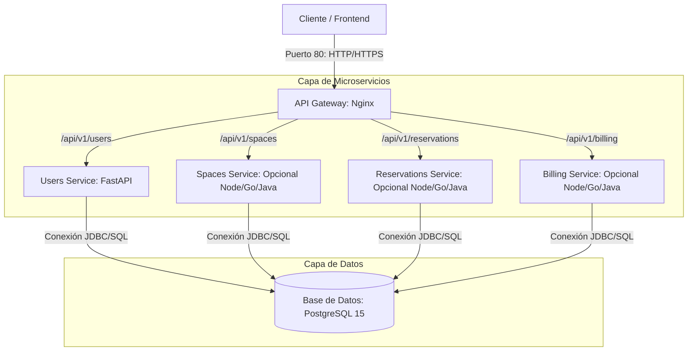
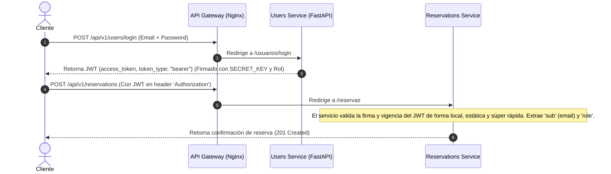

# Arquitectura y Tecnologías del Proyecto Co-working

Este documento describe detalladamente la arquitectura de software, la infraestructura y el ecosistema de tecnologías seleccionadas para el desarrollo de la **Plataforma de Co-working y Reservación de Espacios**.

---

## 🏛️ Diseño Arquitectónico: Microservicios en Monorepo

Para garantizar un desarrollo ágil, modular y escalable, el proyecto se estructura bajo un enfoque de **Monorepo**, donde cada módulo de negocio se implementa como un servicio independiente (microservicio) empaquetado en un contenedor Docker individual.

### Diagrama General del Sistema



---

## 🛠️ Tecnologías y Módulos

El proyecto se divide en 4 módulos lógicos de backend y un servicio de routing (Gateway). Gracias a la contenedorización, **cada módulo puede utilizar un lenguaje y un framework diferente** según los requerimientos técnicos y de rendimiento.

| Módulo | Lenguaje / Framework | Persistencia / BD | Herramientas Clave |
| :--- | :--- | :--- | :--- |
| **API Gateway / Router** | Nginx (Alpine) | N/A | Proxy Inverso, Redirección Dinámica |
| **Usuarios, Roles y Login** | Python 3.11 / FastAPI | PostgreSQL 15 (Compartida) | SQLModel, Alembic, PyJWT, Passlib (Bcrypt) |
| **Gestión de Espacios** | A elección (ej. Node.js/Express) | PostgreSQL 15 (Compartida) | ORM (Prisma/Sequelize) |
| **Motor de Reservas** | A elección (ej. Go o Node.js) | PostgreSQL 15 (Compartida) | Lógica de fechas, control de concurrencia |
| **Facturación y Reportes** | A elección (ej. Java/Spring Boot o Go) | PostgreSQL 15 (Compartida) | Generación de PDFs/Documentos |

---

## 🔑 Mecanismo de Seguridad y Autenticación (JWT & Roles)

Para mantener la **simplicidad** y no agregar sistemas complejos de federación de identidades (como Keycloak o OAuth2 externos), se implementa un esquema de **Autenticación Estateless basada en JWT (JSON Web Tokens)**:



### Características de Seguridad:
1. **Firma Criptográfica:** El token JWT está firmado con un algoritmo simétrico de hashing seguro `HS256` utilizando una palabra clave secreta (`SECRET_KEY`).
2. **Estateless (Sin Estado):** El resto de servicios (Espacios, Reservas, etc.) **no necesitan consultar al microservicio de usuarios ni a la base de datos** para validar si el token es legítimo. Solamente decodifican la firma usando la misma `SECRET_KEY` de forma matemática y local.
3. **Control de Acceso basado en Roles (RBAC):** El token incluye el rol del usuario (por ejemplo, `admin`, `member`, `recepcionista`). Las rutas sensibles en cada microservicio utilizan dependencias de control para validar el rol requerido antes de ejecutar cualquier acción (ej. solo el rol `admin` puede invocar eliminaciones de recursos).

---

## 🗄️ Enfoque de Persistencia: Base de Datos Compartida

Por motivos de **máxima simplicidad y desarrollo ágil**, se ha adoptado el patrón **Base de Datos Compartida (Shared Database)** en lugar de Base de Datos por Servicio.

### Ventajas de este enfoque:
* **Sin Overhead de Infraestructura:** Solo se administra, optimiza y respalda **un único servidor de PostgreSQL**.
* **Consultas directas:** Los diferentes microservicios pueden realizar consultas SQL eficientes que involucren uniones (`JOIN`) o validaciones rápidas sobre otras tablas (por ejemplo, relacionar la reservación de un espacio con el nombre del usuario directamente en la base de datos), evitando el consumo innecesario de peticiones HTTP entre contenedores.
* **Integridad referencial directa:** Posibilidad de definir claves foráneas (`FOREIGN KEY`) reales entre tablas creadas por distintos servicios para asegurar que no queden registros huérfanos.

---

## 🐳 Despliegue Local y Contenedorización

Cada servicio cuenta con su propio archivo `Dockerfile` optimizado y se orquestan juntos utilizando **Docker Compose**.

### Dockerfile del Servicio (Ejemplo: Users Service)
Diseñado para ser extremadamente liviano y seguro, utilizando imágenes `slim` y sin correr como superusuario en entornos de producción:
* **Directorio de trabajo:** `/app`
* **Puertos expuestos:** `8000`
* **Migraciones automatizadas:** Al arrancar el contenedor, este ejecuta de forma autónoma `alembic upgrade head` para garantizar que la base de datos esté siempre en su última versión antes de levantar la API.

### Comando para Levantar el Ecosistema
```bash
docker compose up --build
```
Esto descarga e inicia automáticamente PostgreSQL, Nginx, tu microservicio actual de FastAPI y cualquiera de los módulos adicionales que vayas agregando en el futuro.
